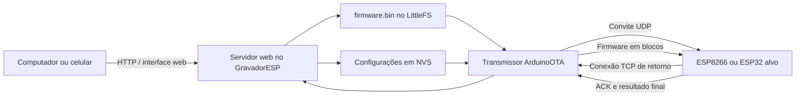

# ESP32 OTA Programmer

Gravador OTA autônomo baseado em **ESP32**, com interface web, armazenamento do firmware em **LittleFS** e transmissão compatível com o fluxo do `espota.py`/`ArduinoOTA`.

O projeto permite enviar um `firmware.bin` para um ESP8266 ou ESP32 remoto sem que o computador precise executar diretamente a etapa de transmissão OTA.

> [!IMPORTANT]
> Este projeto não remove nem contorna as regras da rede. Ele transfere a função de transmissor OTA do computador para um ESP32 autônomo. O GravadorESP e o dispositivo-alvo ainda precisam estar em uma rede autorizada que permita comunicação entre clientes.

## Finalidade

A gravação OTA tradicional é normalmente iniciada pelo computador. Dependendo da configuração do sistema operacional ou da rede, esse processo pode falhar por motivos como:

- firewall do computador bloqueando a conexão TCP de retorno;
- portas de entrada restritas;
- políticas corporativas que impedem a comunicação do `espota.py`;
- computadores sem acesso físico às portas USB;
- necessidade de atualizar equipamentos instalados longe do computador;
- dificuldade para repetir a mesma atualização em vários dispositivos.

O **ESP32 OTA Programmer** atua como um intermediário:

1. o computador ou celular acessa uma página web;
2. o arquivo `firmware.bin` é enviado ao ESP32 gravador;
3. o ESP32 armazena o arquivo em sua própria flash;
4. o gravador inicia a negociação ArduinoOTA com o dispositivo-alvo;
5. o firmware é transmitido pela rede;
6. o alvo valida, grava e reinicia.

O computador precisa apenas de um navegador e acesso HTTP ao gravador.

---

## O que é OTA

**OTA** significa *Over-the-Air* e permite atualizar o firmware de um microcontrolador pela rede, sem conectar novamente um cabo USB ou conversor serial.

No ecossistema Arduino para ESP8266 e ESP32, a biblioteca `ArduinoOTA` recebe a atualização e grava a nova aplicação em uma partição disponível da flash.

### Aplicações

- dispositivos IoT instalados em locais de difícil acesso;
- controladores industriais e sistemas de monitoramento;
- dataloggers;
- automação residencial;
- gateways;
- equipamentos distribuídos em uma rede;
- manutenção e correções de firmware;
- testes repetidos sem acesso físico ao dispositivo.

### Vantagens

- dispensa acesso físico ao alvo após a primeira instalação;
- reduz a necessidade de cabos e conversores USB–serial;
- permite atualizar equipamentos já instalados;
- agiliza testes e manutenção;
- facilita repetir o mesmo firmware em vários dispositivos;
- pode ser operado por computador, celular ou tablet.

### Desvantagens e riscos

- a primeira gravação normalmente ainda precisa ser feita por cabo;
- o firmware do alvo precisa conter `ArduinoOTA.begin()` e executar `ArduinoOTA.handle()`;
- um firmware com falha no Wi-Fi ou sem ArduinoOTA pode exigir recuperação física;
- o alvo precisa possuir espaço de partição suficiente para OTA;
- a atualização depende da estabilidade da alimentação e da rede;
- redes com isolamento de clientes, VLANs ou bloqueio de UDP/TCP podem impedir a transmissão;
- MD5 verifica integridade, mas não substitui assinatura criptográfica;
- uma atualização errada para outro modelo de ESP pode tornar o equipamento indisponível.

---

## Necessidade atendida

Durante uma gravação ArduinoOTA comum, o computador envia um convite UDP e abre um servidor TCP. O ESP remoto responde e conecta de volta ao computador para receber o firmware.

Essa conexão de retorno pode ser bloqueada em computadores com políticas de segurança mais restritivas.

```text
Computador ou celular
        |
        | HTTP
        v
ESP32 OTA Programmer
        |
        | convite UDP + conexão TCP
        v
ESP8266 ou ESP32 alvo
```

Assim, o computador apenas envia o arquivo ao GravadorESP por HTTP. O ESP32 gravador executa a parte do protocolo que normalmente seria realizada pelo `espota.py`.

Isso resolve limitações locais do computador, mas **não ignora** bloqueios da infraestrutura Wi-Fi. A rede ainda precisa permitir que o gravador e o alvo conversem diretamente.

---

## Arquitetura



### Servidor web

A interface permite:

- selecionar e salvar a rede Wi-Fi;
- informar IP, hostname ou mDNS do alvo;
- configurar porta OTA;
- configurar timeout;
- informar senha OTA opcional;
- enviar e excluir o `firmware.bin`;
- acompanhar estado e progresso.

### Preferences/NVS

Armazena:

- SSID e senha da rede;
- endereço do alvo;
- porta OTA;
- timeout;
- senha OTA;
- nome e MD5 do último firmware.

### LittleFS

Armazena o arquivo:

```text
/firmware.bin
```

O arquivo é recebido em blocos, sem precisar permanecer inteiro na RAM.

Antes de ser aceito, o gravador verifica:

- tamanho;
- espaço livre;
- cabeçalho de imagem ESP (`0xE9`);
- MD5;
- conclusão correta do upload.

### Transmissor OTA

O fluxo implementado é compatível com o protocolo utilizado pelo `espota.py`:

1. resolve IP, hostname ou mDNS;
2. abre um servidor TCP local na porta `32320`;
3. envia um convite UDP ao alvo;
4. informa comando, porta de retorno, tamanho e MD5;
5. trata autenticação MD5 opcional;
6. aguarda o alvo abrir a conexão TCP;
7. envia o firmware em blocos de até `1460 bytes`;
8. aguarda confirmações;
9. recebe o resultado final;
10. informa sucesso ou erro à interface web.

### Portas padrão do alvo

| Plataforma | Porta ArduinoOTA |
|---|---:|
| ESP8266 | `8266` |
| ESP32 | `3232` |

---

## Hardware

O protótipo foi desenvolvido com:

- ESP32-WROOM-32E;
- flash de 4 MB;
- indicadores bicolores;
- botão de controle;
- alimentação própria;
- interface serial para a primeira gravação.

Não é necessário cartão de memória.

### Particionamento da flash

| Partição | Tamanho aproximado |
|---|---:|
| Aplicação do GravadorESP | 1,50 MiB |
| LittleFS | 2,44 MiB |
| NVS e dados do sistema | área reservada |

O espaço útil para o `firmware.bin` fica próximo de 2,4 MiB, descontando metadados.

> [!NOTE]
> O tamanho máximo aceito pelo GravadorESP não garante que o alvo possa receber o arquivo. A partição OTA do alvo também precisa ser grande o suficiente.

### Mapeamento do protótipo

| Função | GPIO |
|---|---:|
| Wi-Fi vermelho | 32 |
| Wi-Fi verde | 33 |
| Server vermelho | 25 |
| Server verde | 26 |
| OTA vermelho | 27 |
| Botão | 12 |
| LED verde RS-485 | 13 — não utilizado |

Para outra placa, adapte o namespace de pinos no código.

---

## Estados dos LEDs

### Wi-Fi

| Estado | Significado |
|---|---|
| Vermelho piscando | tentando conectar |
| Vermelho fixo | modo AP de manutenção |
| Verde fixo | conectado à rede |

### Server

| Estado | Significado |
|---|---|
| Verde fixo | servidor e LittleFS prontos |
| Verde piscando | recebendo firmware |
| Vermelho | erro de armazenamento ou upload |

### OTA

Somente o canal vermelho é utilizado:

| Estado | Significado |
|---|---|
| Piscando lentamente | negociação |
| Piscando rapidamente | transmissão |
| Aceso por alguns segundos | atualização concluída |
| Padrão de erro | timeout ou falha |

---

## Requisitos

### Gravador

- ESP32 compatível com Arduino;
- flash suficiente;
- PlatformIO recomendado;
- rede Wi-Fi de 2,4 GHz.

### Alvo

- ESP8266 ou ESP32;
- firmware inicial com ArduinoOTA;
- `ArduinoOTA.begin()` executado;
- `ArduinoOTA.handle()` chamado frequentemente;
- partição compatível com OTA;
- alimentação estável;
- comunicação permitida com o GravadorESP.

### Rede

- gravador e alvo na mesma rede ou com roteamento entre eles;
- comunicação UDP e TCP liberada;
- ausência de isolamento de clientes;
- DHCP ou IP válido;
- mDNS liberado, caso `.local` seja usado.

Durante os primeiros testes, prefira IP direto.

---

## Preparando o dispositivo-alvo

### ESP8266

```cpp
#include <Arduino.h>
#include <ESP8266WiFi.h>
#include <ArduinoOTA.h>

const char* ssid = "SUA_REDE";
const char* password = "SUA_SENHA";

void setup() {
    WiFi.mode(WIFI_STA);
    WiFi.begin(ssid, password);

    while (WiFi.status() != WL_CONNECTED) {
        delay(250);
    }

    ArduinoOTA.setHostname("esp-ota-alvo");
    ArduinoOTA.setPort(8266);

    // ArduinoOTA.setPassword("senha_ota");

    ArduinoOTA.begin();
}

void loop() {
    ArduinoOTA.handle();
}
```

### ESP32

```cpp
#include <Arduino.h>
#include <WiFi.h>
#include <ArduinoOTA.h>

const char* ssid = "SUA_REDE";
const char* password = "SUA_SENHA";

void setup() {
    WiFi.mode(WIFI_STA);
    WiFi.begin(ssid, password);

    while (WiFi.status() != WL_CONNECTED) {
        delay(250);
    }

    ArduinoOTA.setHostname("esp32-ota-alvo");
    ArduinoOTA.setPort(3232);

    // ArduinoOTA.setPassword("senha_ota");

    ArduinoOTA.begin();
}

void loop() {
    ArduinoOTA.handle();
}
```

Evite operações bloqueantes longas no `loop()`.

---

## Obtendo o `firmware.bin`

### PlatformIO

```bash
pio run
```

Arquivo gerado:

```text
.pio/build/<nome_do_ambiente>/firmware.bin
```

### Arduino IDE

Use:

```text
Sketch > Export Compiled Binary
```

Selecione o binário principal da aplicação:

```text
nome_do_projeto.ino.bin
```

### Não envie

- `bootloader.bin`;
- `partitions.bin`;
- `merged.bin`;
- `spiffs.bin`;
- `littlefs.bin`.

A versão atual transmite somente o firmware principal da aplicação.

---

## Compilando o GravadorESP

A versão funcional está na pasta:

```text
gravador 2.0/
```

Compile:

```bash
pio run
```

Grave pela serial:

```bash
pio run -t upload
```

Na primeira utilização da tabela personalizada:

```bash
pio run -t erase
pio run -t upload
```

---

## Primeira configuração

Se não conseguir conectar à rede salva, o gravador cria:

```text
SSID: GravadorESP
Senha: gravador123
Endereço: http://192.168.4.1
```

> [!WARNING]
> Troque a senha padrão antes de usar fora de ambiente de teste.

Na página:

1. selecione a rede Wi-Fi;
2. informe a senha;
3. salve e aguarde o reinício;
4. consulte o IP no monitor serial;
5. tente `http://gravadoresp.local`;
6. se o mDNS não funcionar, use o IP.

---

## Realizando uma gravação

1. Conecte GravadorESP e alvo à mesma rede.
2. Confirme que o alvo está executando ArduinoOTA.
3. Abra a interface do gravador.
4. Informe IP, hostname ou mDNS.
5. Escolha a porta:
   - ESP8266: `8266`;
   - ESP32: `3232`.
6. Configure o timeout.
7. Informe a senha OTA, se houver.
8. Clique em **Salvar destino**.
9. Selecione o `firmware.bin`.
10. Clique em **Enviar firmware**.
11. Confira nome, tamanho e MD5.
12. Clique em **Gravar ESP remoto**.
13. Acompanhe o progresso.

O botão físico pode iniciar a gravação usando o destino e o firmware salvos. Uma pressão longa durante a transmissão pode cancelar a operação.

---

## Limitações atuais

- transmite somente firmware de aplicação (`U_FLASH`);
- não transmite imagem LittleFS ou SPIFFS;
- armazena um firmware por vez;
- utiliza HTTP sem TLS;
- não atualiza o próprio GravadorESP por OTA na tabela atual;
- depende da compatibilidade do alvo com ArduinoOTA;
- não funciona em redes com isolamento entre clientes;
- mDNS pode ser bloqueado em redes corporativas;
- a interface e a recuperação de falhas ainda podem ser refinadas;
- autenticação e assinatura do firmware ainda podem ser fortalecidas.

---

## Segurança

Use apenas em dispositivos próprios ou cuja manutenção esteja autorizada.

Recomendações:

- não exponha a interface à Internet;
- altere a senha padrão do AP;
- utilize senha ArduinoOTA;
- considere adicionar autenticação à interface web;
- mantenha o gravador em uma rede de manutenção;
- não publique credenciais;
- valide modelo, arquitetura e tamanho antes de gravar;
- mantenha uma forma física de recuperação;
- considere assinatura criptográfica em aplicações críticas.

O MD5 detecta corrupção acidental, mas não comprova autoria ou confiabilidade do firmware.

---

## Solução de problemas

### Não conecta ao Wi-Fi

Verifique:

- 2,4 GHz;
- senha;
- WPA2/WPA3 e PMF;
- DHCP;
- cadastro de MAC;
- políticas para IoT;
- intensidade do sinal.

### Associa, mas não recebe IP

Pode indicar:

- falha de DHCP;
- VLAN sem DHCP;
- NAC;
- bloqueio de dispositivos não cadastrados;
- pool de endereços esgotado.

### `gravadoresp.local` não funciona

Use o IP direto. Algumas redes bloqueiam multicast/mDNS.

### O alvo não responde

Confira:

- IP ou hostname;
- porta;
- `ArduinoOTA.begin()`;
- `ArduinoOTA.handle()`;
- senha OTA;
- isolamento entre clientes;
- regras da rede.

### O alvo recusa o firmware

Confira:

- arquitetura correta;
- tamanho da partição OTA;
- arquivo principal da aplicação;
- espaço de flash;
- integridade;
- alimentação.

### O alvo não aceita novo OTA após a atualização

O novo firmware pode ter removido ArduinoOTA, deixado de chamar `handle()`, perdido o Wi-Fi ou alterado porta/senha. Pode ser necessária recuperação por cabo.

---

## Estrutura do repositório

```text
esp32-ota-programmer/
├── gravador 2.0/          # transmissor OTA funcional
├── gravador 1.0/          # rede, página e armazenamento
├── Teste_HW_ESP32/        # diagnóstico do hardware
├── flashsize_esp32/       # identificação da flash
├── OTA_base/              # exemplo básico ArduinoOTA
├── OTA_conect_wifi/       # teste de conexão
├── OTA_teste_pisca/       # validação de atualização
├── LICENSE
└── README.md
```

Recomenda-se futuramente evitar espaços nos nomes:

```text
gravador_v1_0/
gravador_v2_0/
```

---

## Roadmap

- máquina de estados mais robusta;
- reconexão automática;
- cancelamento e recuperação aprimorados;
- autenticação web;
- assinatura digital do firmware;
- descoberta `_arduino._tcp`;
- múltiplos firmwares;
- atualização de filesystem;
- histórico e logs exportáveis;
- IP estático opcional;
- múltiplos alvos;
- atualização OTA do próprio gravador;
- diagnóstico de redes corporativas.

---

## Licença

Distribuído sob a licença **BSD 3-Clause**. Consulte [`LICENSE`](LICENSE).

## Autor

**Pedro Sakuma**  
GitHub: [@akioShaolin](https://github.com/akioShaolin)
